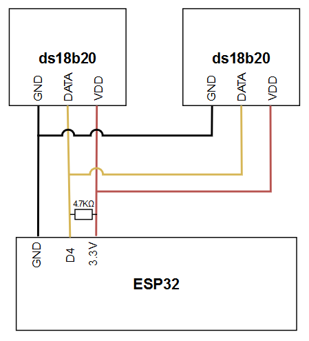

# Module for temperature sensors ds18b20

**Manufacturer:**  Maxim Integrated
**Model:** ds18b20
**Module type (code):**  DS18B20
**Protocol:** 1-Wire
**Author:** Adam Snincak

**Datapoints:**

| Datapoint name | Datapoint code | Units | Description |
|:-:|:-:|:-:|:-:|
| Temperature | temp | °C | Temperature (°C) |

**Address format:**
* 8 bytes with space as delimiter
* example: 28 84 54 79 97 04 03 12

**Connection scheme**
* use 4.7KΩ resistor
* use ESP32 pin D4 (GPIO4)

